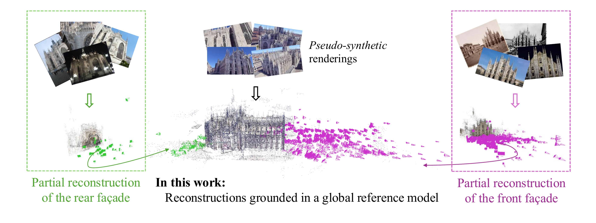

# Scene Grounding In the Wild

This is the official implementation of Scene Grounding In The Wild.

[](https://cvpr.thecvf.com/)
[](https://arxiv.org/abs/2603.26584)

[[Project Website](https://tau-vailab.github.io/SceneGround/)]

> **Scene Grounding In the Wild**<br>
> Tamir Cohen<sup>1</sup>, Leo Segre <sup>1</sup>, Shay Shomer Chai<sup>1</sup>, Shai Avidan <sup>1</sup>, Hadar Averbuch-Elor <sup>2</sup><br>
> <sup>1</sup>Tel Aviv University, <sup>2</sup>Cornell University

>**Abstract** <br>
> Reconstructing accurate 3D models of large-scale real-world scenes from unstructured, in-the-wild imagery remains a core challenge in computer vision, especially when the input views have little or no overlap. In such cases, existing reconstruction pipelines often produce multiple disconnected partial reconstructions or erroneously merge non-overlapping regions into overlapping geometry. 
In this work, we propose a framework that grounds each partial reconstruction to a complete reference model of the scene, enabling globally consistent alignment even in the absence of visual overlap. 
We obtain reference models from dense, geospatially accurate pseudo-synthetic renderings derived from Google Earth Studio. These renderings provide full scene coverage but differ substantially in appearance from real-world photographs. Our key insight is that, despite this significant domain gap, both domains share the same underlying scene semantics. We represent the reference model using 3D Gaussian Splatting, augmenting each Gaussian with semantic features, and formulate alignment as an inverse feature-based optimization scheme that estimates a global 6DoF pose and scale while keeping the reference model fixed. 
Furthermore, we introduce the WikiEarth dataset, which registers existing partial 3D reconstructions with pseudo-synthetic reference models. We demonstrate that our approach consistently improves global alignment when initialized with various classical and learning-based pipelines, while mitigating failure modes of state-of-the-art end-to-end models.


</br>

## Overview
This implementation is built on top of the [Nerfstudio](https://github.com/nerfstudio-project/nerfstudio) framework

## Installation

### Environment Setup

Create a conda environment and install the required dependencies:

```bash
# Create environment
conda create -n scene_grounding python=3.10
conda activate scene_grounding
./scripts/setup_env.sh
```
Install colmap 3.10 (https://colmap.github.io/install.html)

### Data Download
Run `./scripts/prepare_dataset.sh` to download the WikiEarth and WikiScenes datasets.


## Usage

### Running the Full Pipeline

To create the 3D Gaussian Splatting base model, prepare the meta image, run the colmap baseline initializaiton and run registration:

```bash
./scripts/pipelines/full_pipeline.sh 39 4 dino
```

**Parameters:**
- `cathedral_number`: This first argument Cathedral ID from WikiScenes dataset
- `colmap_number`: The second argument Meta image number from WikiScenes 3D reconstruction
- `feature_type`: Feature extraction method (use `dino` to reproduce paper results)

The 7DOF transform will be written to `./transforms`

### Running Registration Only

To run only the registration component:

```bash
./scripts/pipelines/features_pipeline.sh <cathedral_number> <feature_type> <colmap_number>
```


# Acknowledgments 
This work is built upon the Nerfstudio framework. We thank the Nerfstudio team for their excellent codebase and tools that made
this research possible. 


## BibTeX
If you find our work useful in your research, please consider citing:

```bibtex
@misc{cohen2026scenegroundingwild,
      title={Scene Grounding In the Wild},
      author={Tamir Cohen and Leo Segre and Shay Shomer-Chai and Shai Avidan and Hadar Averbuch-Elor},
      year={2026},
      eprint={2603.26584},
      archivePrefix={arXiv},
      primaryClass={cs.CV},
      url={https://arxiv.org/abs/2603.26584},
}
```

